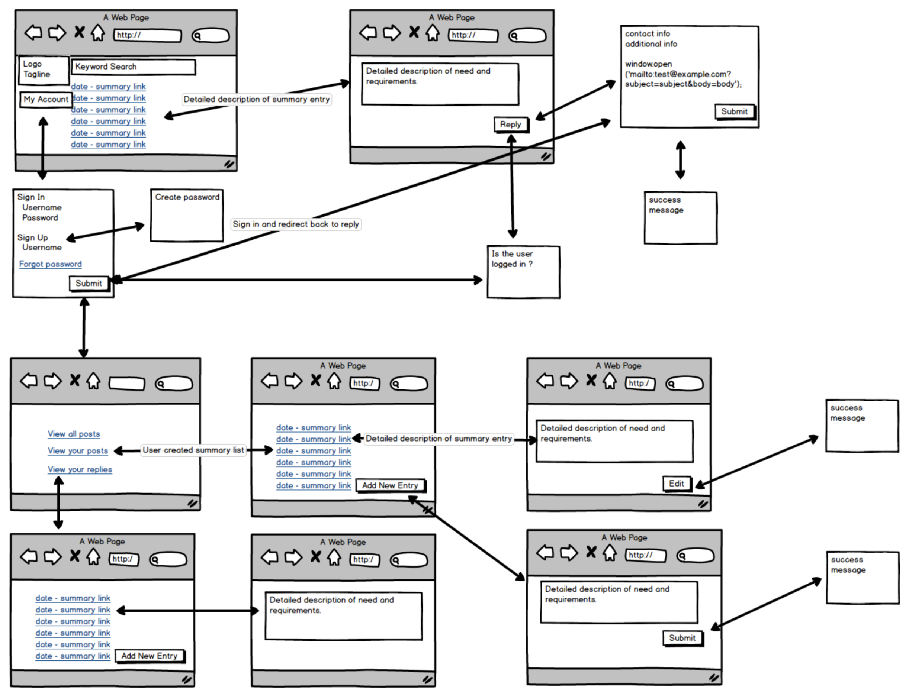

# Welcome to **Developer OCS**
An interactive, open source web application for developers to post, find and collaborate on portfolio-grade projects. This is a resource for developers of all skill levels: students, graduates (bootcamp or university), self-taught or anywhere in between. It's also an open bulletin for companies to have pilot projects built or try out new technologies while finding skilled resources dedicated to their craft who are looking to work on real-world applications.

## See it live at: https://developer-ocs.herokuapp.com/ 

## **Current features**
* Login and authenticate with **GitHub** or **Google+**
* View all projects posted by all users of the app
* Post a project of your own, for other contributors to view and reply
    * Project Title
    * Project Description
    * Languages to be used
* View all projects you have posted
    * Delete projects that have been completed or filly resourced
* Save projects and view them in a separate list
* Reply directly to posters of projects
 

## **Built with**
* Axios
* CSS3
* Express
* Express Sessions
* HTML5
* MySQL2
* Passport
* React
* React-Sanfona
* Sequelize

***
## **Issue Tracking** & **Project Planning** for Phase I (MVP)
**Issue Tracking:** [GitHub Issues](https://github.com/drewwmercer/developer-ocs/issues "Issue Tracking via GitHub")  
**Project Planning:** [GitHub Projects](https://github.com/drewwmercer/developer-ocs/projects/1 "Project Planning with GitHub")

## **Schedule**
**Phase I: Complete**
- [x] 14-Nov-2017: Deliverable 1, project plan
- [x] 21-Nov-2017: Deliverable 2, demo of MVP
- [x] 28-Nov-2017: Deliverable 3, cleanup and polish
- [x] 07-Dec-2017: Deliverable 4, final presentation

## Background/Planning
**Wireframes:**

